# 🦋 Butterfly LED Panel: Smart Light for ESPHome

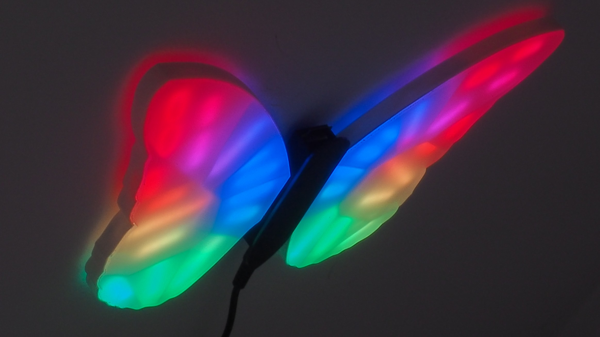

- [🦋 Butterfly LED Panel: Smart Light for ESPHome](#-butterfly-led-panel-smart-light-for-esphome)
  - [Supplies](#supplies)
  - [Concept and Design Considerations](#concept-and-design-considerations)
  - [Shaping the Butterfly](#shaping-the-butterfly)
  - [CAD](#cad)
    - [3D Modelling](#3d-modelling)
    - [Placing the LEDs](#placing-the-leds)
  - [Controller](#controller)
    - [Schematic and PCB](#schematic-and-pcb)
    - [Connectors](#connectors)
    - [Housing](#housing)
  - [Assembly](#assembly)
    - [Manufacturing](#manufacturing)
    - [Preparations](#preparations)
    - [Soldering](#soldering)
    - [Connector](#connector)
    - [Diffusing the light](#diffusing-the-light)
  - [Making The Panel Touch Sensitive](#making-the-panel-touch-sensitive)
  - [Software](#software)
    - [Substitutions](#substitutions)
    - [ESPHome configuration](#esphome-configuration)
    - [API and interfaces](#api-and-interfaces)
    - [Peripherals configuration](#peripherals-configuration)
    - [Lights](#lights)
    - [Touch controls](#touch-controls)
  - [Final Thoughts](#final-thoughts)


I've always been a fan of light panels, at least ever since I first saw
[Nanoleaf's products](https://nanoleaf.me/). My apartment has slanted walls, and
it's always been an issue to light it properly. Nanoleaf light panels got the
job done, but one place left without proper lighting: kid's bed, right
underneath a slanted wall.

At first I figured I'd just pay up and buy more light panels. But she's such a
big fan of butterflies - already had tons of stickers on that wall. Then it
struck me: I could make her a butterfly-shaped light panel to serve as a night
light. So, here goes.

## Supplies

Full bill of materials, with prices (in PLN, sorry), is attached. It includes
full BOM for PCB, including  [LCSC](https://lcsc.com/)  part numbers, estimated
prices, etc.

In addition to the PCB and its components, you'll need:
- 3D printed frame
- 3D printed case for controller
- plexi, 3 mm thick, white (laser cut is best)
- plexi, 2 mm thick, frosted (laser cut is best)
- plexi, 3 mm thick, black (laser cut is best)
- 5V 8A power supply with 2.1 mm DC jack plug
- WS2813 LED strip, 144 LED/m (different LED models can be used as well)
- Conductive PET sheet:
  https://kamami.pl/en/conductive-materials/563060-conductive-pet-ito-with-dimensions-100mm-x-200mm.html
- 4x1 Goldpin header
- DC barrel jack socket, 2.1 mm
- (optional) TE-Connectivity 1-1954289-2 connectors:
  https://www.arrow.com/en/products/1-1954289-2/te-connectivity
- some baking paper
- lots of wires, including 22AWG or similar
- general purpose glue

I estimate total cost of materials above to ~$110 USD, with the current exchange
rate.

## Concept and Design Considerations

I wanted the panel to have sections which could be individually lit to form of a
[low poly
butterfly](https://www.google.com/search?q=low+poly+butterfly&client=opera&hs=mmj&sxsrf=APq-WBtdjmTwirM-b7sVY4Ri69_1T6-vsw:1650900132022&source=lnms&tbm=isch&sa=X&ved=2ahUKEwjdtbafwq_3AhXHSvEDHZS5BSMQ_AUoAXoECAEQAw&biw=2061&bih=1141&dpr=1)
(I really like the low poly aesthetics). I also assumed use of a cut down LED
strip, to save time and money on custom PCBs, and ESP32 as a controller for the
lights, because I wanted to use  [ESPHome](https://esphome.io/)  for controlling
the lights and integrating into Home Assistant setup. I also wanted these panels
to be controllable locally (i.e., without having to use smartphone), ideally by
making the panels touch sensitive.

With these design constraints there are several options, choices to be made for
	the design: - use analogue RGB/RGBW strips vs. addressable ones - have the
	light built from multiple small panels vs. few larger ones, divided into
	segments

There are some serious cons to using analogue strips, especially given the
constrains: typical analogue LED strip needs it's own PWM driver for each
channel. This makes routing connections way more difficult and also pretty much
breaks the "save time and money on custom PCBs" assumption. Assuming use of
multiple panels, it would take a few dozen panels to create a low poly
butterfly. Total number of PWM signals would exceed number of PWM outputs in
ESP32. To mitigate, each panel would have to have its own micro-controller,
which would use a communication bus to receive commands from the controller.

In short, too complicated and bumps up the cost of each panel. Summarizing:
1.  analogue LED strip/many panels:
2.  needs custom PCB with LED drivers and separate uC per panel
3.  analogue LED strip/few panels
4.  still needs lots of LED drivers and custom PCB, slightly easier to route
    connections than 1st one
5.  addressable LEDs/many panels
6.  increased cost of 3D printing cases for panels, but only one wire needed to
    control all the LEDs
7.  addressable LEDs/few panels
8.  well... this could work.

There are so many different addressable LED strips available, it's difficult to
pick one. I decided to go with a dense strip (144 LEDs/m) based on WS2813
devices. Downside is that this strip has a rated power consumption of 43W/m. So,
a lot of current to supply at 5V...

That's how my smart light ended up having two separate panels (wings!) and
controller in the middle. But what about the low poly part? It's difficult to
get the low poly effect with just two panels. Luckily, in one of my other
projects I noticed that LED lights can be nicely partitioned. More on that
later.

## Shaping the Butterfly

For the silhouette of the butterfly, I went to trusty
[openclipart.org](http://openclipart.org/)  library. Found  [Monarch
butterfly](https://openclipart.org/detail/224784/monarch-butterfly)
cliparclip-artt, wonderful shape with decent amount of space for placing all the
LEDs. A bit of Inkscape magic, and I got the raw silhouette of a butterflies'
wing. I scaled it so that it would have diagonal of ~20 cm. I also modified the
shape a bit so that it has a distinct straight edge to which controller could
attach.


This created the outer edge of the panel. Two additional paths will be needed
later: one for marking where the internal support for panel's cover starts, and
the other is an inner edge. This can be done by cloning and shrinking the
initial shape. Best to keep approx. 2 mm of separation between the outlines.

For the whole low poly thing, I used Inkscape's Effects tool to generate a
[Voronoi diagram](https://en.wikipedia.org/wiki/Voronoi_diagram)  within the
constraints of inner edge. While low poly structures are typically composed of
triangles, this pattern gets the job done, as well.

## CAD

### 3D Modelling

Completed SVG now can be used to quickly start with 3D modelling. I'm using
[FreeCAD](https://www.freecadweb.org/), but any tool will do. You'll find
FreeCAD file in here:  https://github.com/lukasz-tuz/lowpolylight-cad.

First step is to extrude panel outline, by 3 mm, to form a back plate of the
panel. This part could be 3D printed, but I ordered it as a laser-cut white
plexiglass, opaque. It tends to be cheaper than 3D printing, and creates a
smoother shapes.

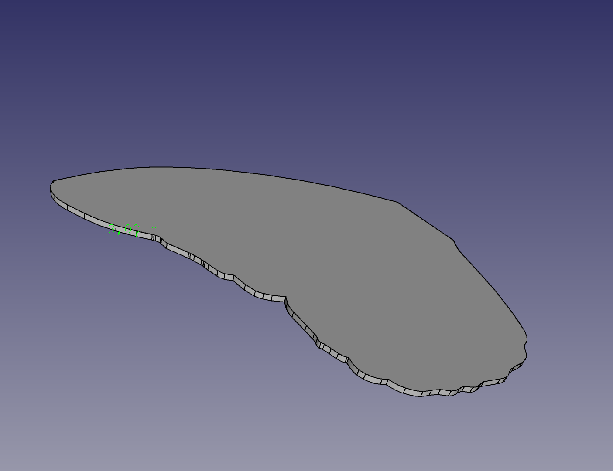

Next part is the side wall. Side wall contains a small cut, 2 mm deep, roughly
1.5 mm wide, which will be used to support front panel. That's where the inner
edges from SVG come in handy: extrude outer edge (12 mm should be enough space
to diffuse light from LEDs), extrude middle edge by 2 mm, and subtract.

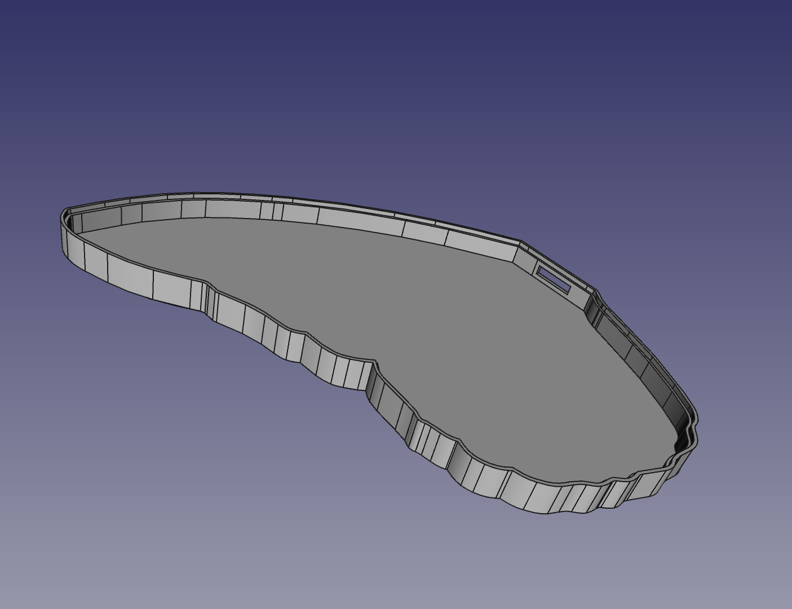

Wall also should have a small cutout on a side for connecting to the controller.

Once wall is ready, it's time for the Voronoi pattern. This actually takes some
manual drawing. Pattern imported from SVG is handy, but can't be directly
extruded as all the lines are one dimensional. FreeCAD's sketching tool helps
here, but care has to be taken to ensure that the pattern overlaps with walls.
It won't be possible to print this part, otherwise.

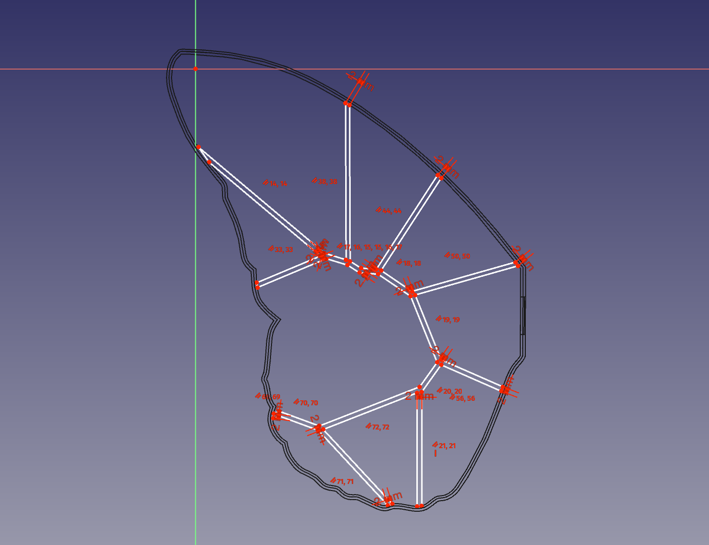

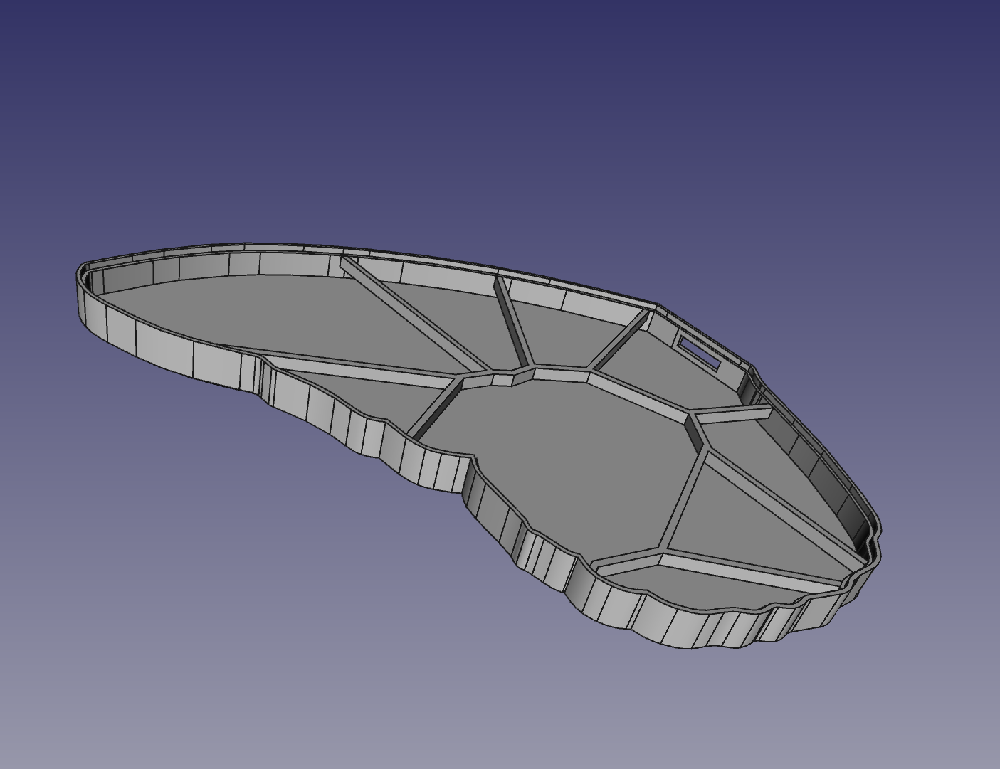

Note the 6 mm gap between lower edge of pattern walls and back of the panel.
This way pattern walls block some of the light of LEDs inside a partition,
creating nice effect of a light segment.

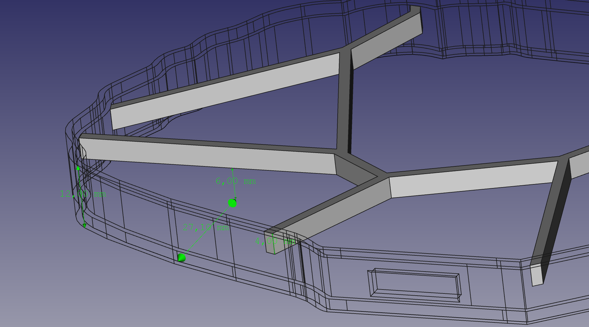

Finally, front cover is created by extruding the inner edge from SVG. This part
could also be 3D printed (standard resin would do nicely), but again, I used
laser-cut plexi, 2 mm, this time with 30% opacity.

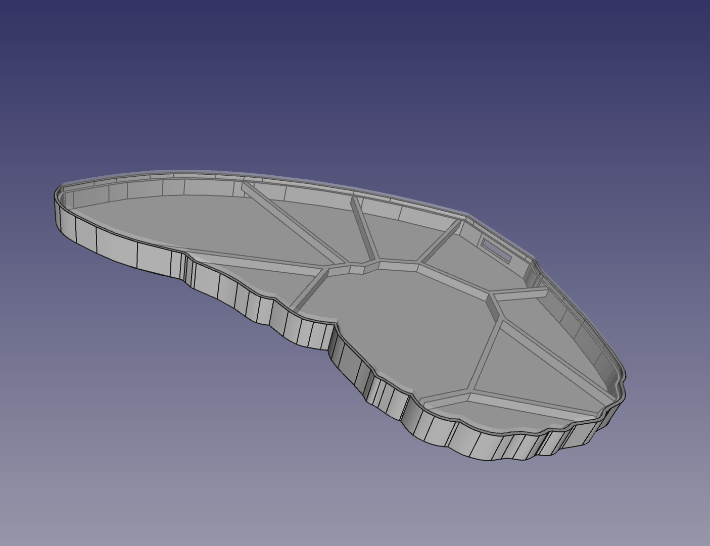

Design parts have to be cloned by mirroring to form a second wing.

### Placing the LEDs

It's all fun, 3D models for wings are ready, but how many LEDs will  *actually*
fit in there?

I wanted each segment in the Voronoi pattern generating enough light so that
this panel would be a usable light source, but at the same time, it'd be best to
try and limit current drawn by the diodes.

I ended up placing 65 LEDs per wing, and frankly, I overdid it. Whole thing
would still work with half the amount of LEDs. Oh well.

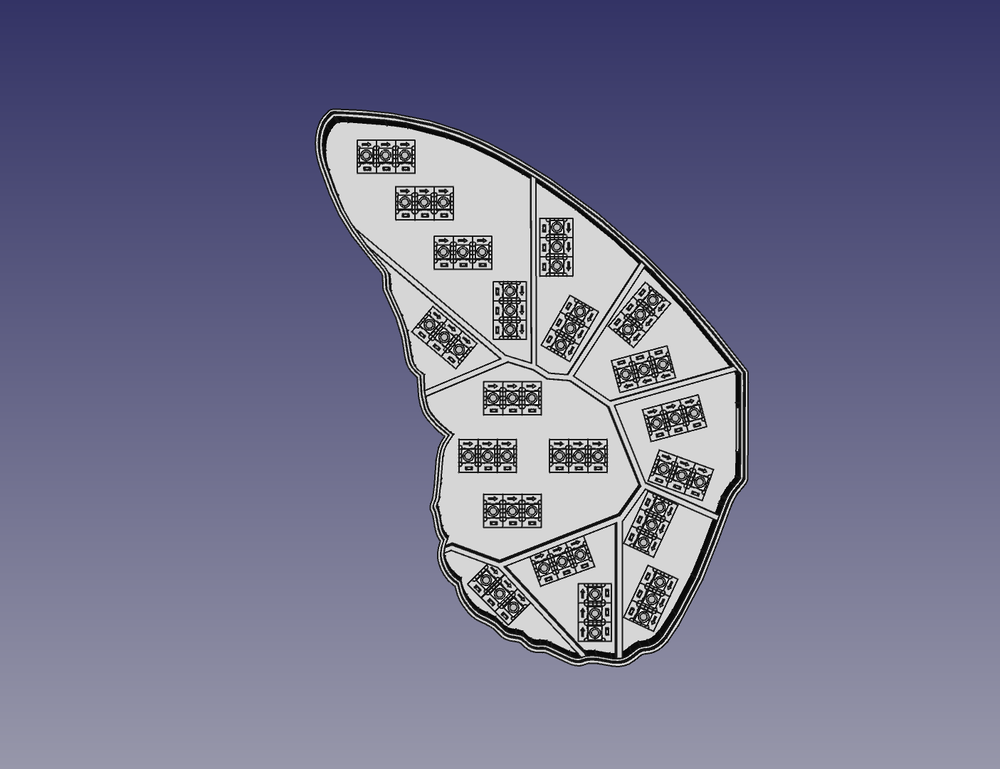

Some numbers:

- 65 LEDs per wing, total of 130 in the panel.
- with 144 LEDs per meter, 43 Watts power draw per meter, single LED consumes
  **~0.3 W at 5V**
- 130 LEDs would consume  **39 Watts**.

These numbers will be needed for the next step.

<script src="https://embed.github.com/view/3d/lukasz-tuz/rgb-butterfly/main/docs/lowpoly-butterfly.stl"></script>

## Controller

### Schematic and PCB

At first, full disclaimer: power delivery part of the controller could've (and
should've) been done better. Right now it's a very simple device, merged from
application notes for ESP32 and the voltage stabilizer.

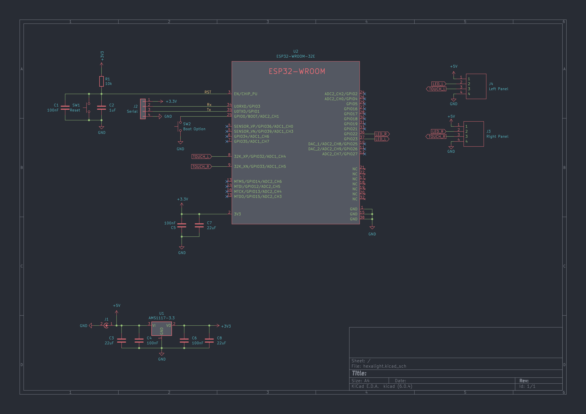

Controller is built around ESP32 IoT module - ESP32-WROOM. These modules are
affordable, yet capable, and easy to obtain. Following typical application
circuit from ESP32-WROOM's datasheet:

- two capacitors (C5, C7; 100nF and 22uF) are filtering the 3.3V supply
- two capacitors filter the 'EN' pin; this pin is also pulled up to 3.3V by 10k
  resistor
- push button SW1 connects 'EN' pin to ground, forcing it to reset
- push button SW2 is used as boot mode selector (holding SW2 while pressing SW1
  makes the module fetch code from serial port)

Power to the module is provided by a single AMS1117-3.3 voltage stabilizer. This
device is ubiquitous, can be found on almost all low-cost development boards for
ESP. Few capacitors connect input and output of the device to ground.
AMS1117-3.3 is internally wired to output a 3.3V, so no additional resistors are
required. Input to the stabilizer comes directly from 5V power supply.

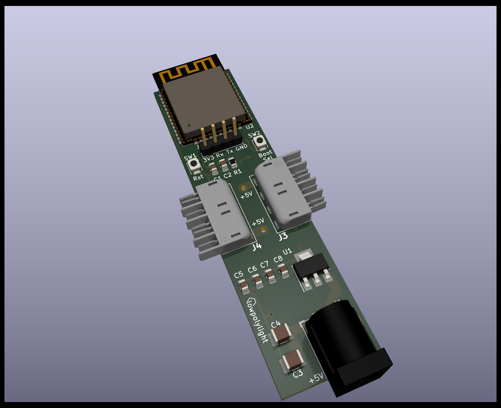

Given the power-hungriness of selected diodes, PCB traces which supply power to
the panels are pretty thick - 2 mm, with 0.8 mm min distance from other nets.
Given the current (up to 8 amps!), this net should've been even thicker, or
divided into two separate ones.

### Connectors

Given the amount of current which could potentially flow to the LEDs, connection
between controller and panels really should not be done by your run of the mill
goldpins. XST connectors typically used for LED strips would do the trick, but
are too bulky to be of use here.

Took some digging, but I finally found  [TE Connectivity
1-1954289-2](https://www.arrow.com/en/products/1-1954289-2/te-connectivity),
which is perfect for the job. 4 pins are needed:

- +5V
- ground
- LED control line
- touch sensors

Note that the cutout in panel's wall is just big enough to house this connector.

There's also a standard issue gold pin connector for serial port. Ground and
+3.3V nets are routed to that connector, so any type of USB-to-serial converter
can be used. Just make sure to not connect +5V to the +3.3V pin of the serial
port header. ESP32 will probably survive but no point in taking chances.

> However, soldering wires instead using some exotic connector will work just as
> fine.

### Housing

Now, back to drawing board. Err, CAD. Controller can't just hang there between
the panels, it needs a casing. Since - as usual - I rushed PCB design and forgot
about mounting holes, I decided to design a very simple 3D printed case in which
the PCB would rest, held in place by connectors. Cover for the case is laser cut
plexi, black this time, in shape of butterfly's body. Cover is wider and longer
than the case itself, so it hides all connectors.

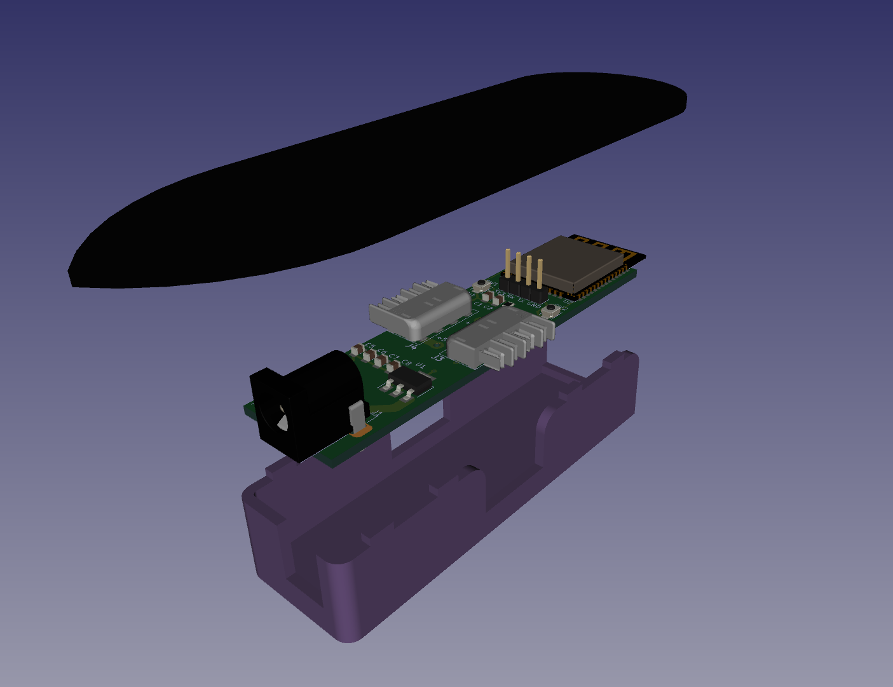

Case has also small rectangular cutouts in which case fits. Cutouts are slightly
(0.1 mm) smaller in each direction than the mounting pins on the case, so it
doesn't really need any glue or screws.

## Assembly

### Manufacturing

I ordered the laser-cut and 3D-printed parts at
[ajmaker.pl](http://ajmaker.pl/), they offer good quality with reasonable prices
(and I am not affiliated with them in any way, I just buy stuff from them :)).

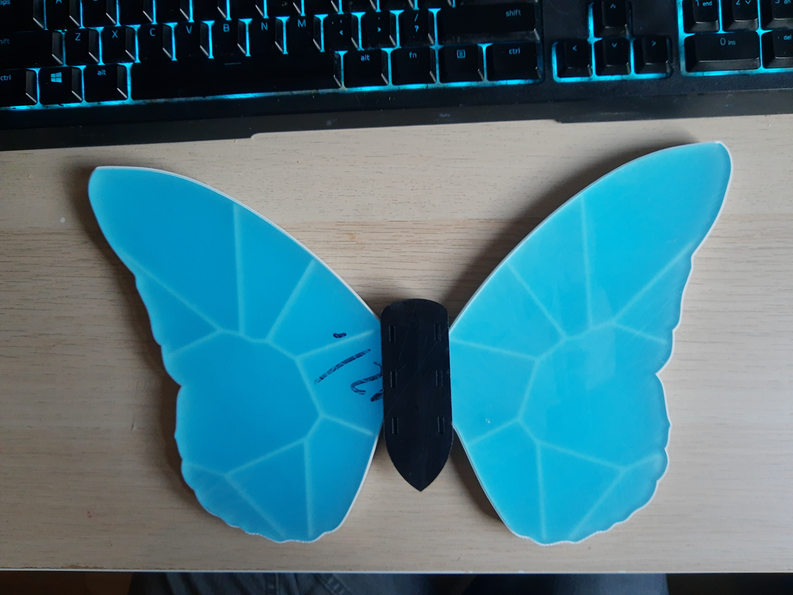

Note on 3D printing the side wall/Voronoi pattern: make sure to use material
with the highest temperature resistance you can find. LEDs can get hot!

Controller's PCB (including SMT assembly) was made by
[JLCPCB](https://www.jlcpcb.com/see), I highly recommend their services. It's
super easy to place the order using their online interface - just add gerber
files (live preview!), select options for the PCB - base material, number of
layers, color (purple PCB, anyone?), thickness, etc. - add to cart and done. If
anything's wrong or not clear, their engineers will contact you to resolve
things. SMT service is great as well. Lots and lots of parts in stock so it's
easy to find matching devices.

Once all the parts arrive, it's time for some assembly.

### Preparations

First step here is to cut the LED strip into fragments matching the CAD design
and arrange them on the back plate of the panel. When arranging, make sure that
LED strip fragments are arranged so that ground and power supply pins are next
to each other in adjacent fragments. Otherwise laying down the wires will get
complicated. Fragments of the LED strip can be glued to the back plate at this
point, it'll make soldering bit easier later on.

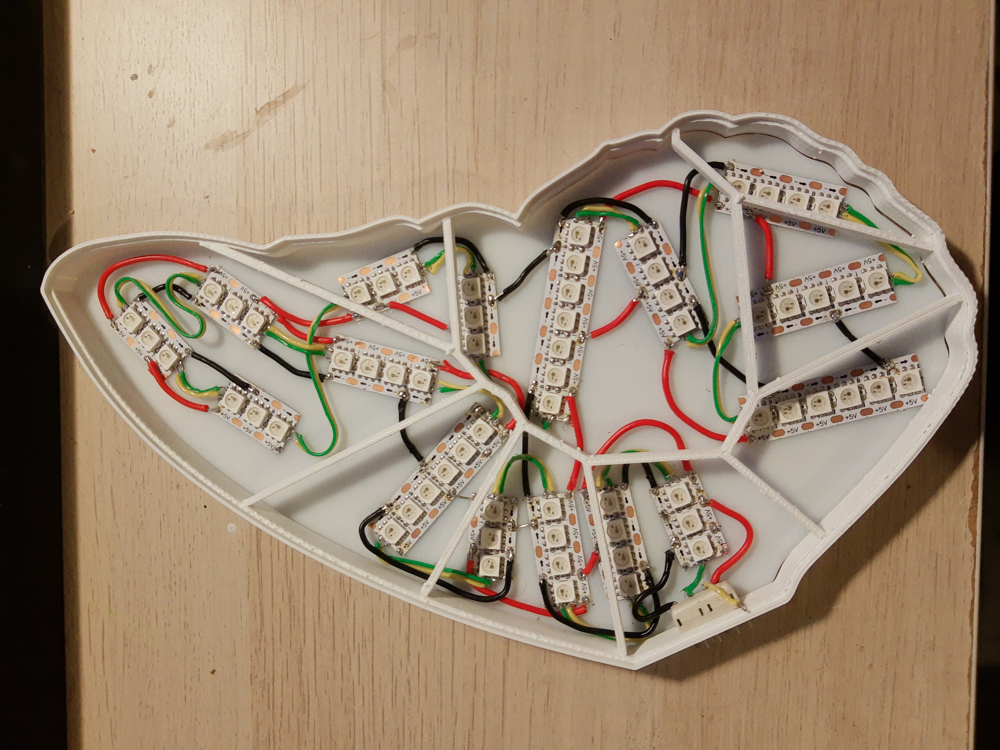

### Soldering

Even though its cut down, it still is a LED strip. Addressable LEDs use just one
wire (in case of WS2813 diodes I used - two wires, additional wire serves as
backup) for control, but all devices need to be connected in chain on the same
wire. So, it is important arrange and solder all the LED fragments as a chain,
avoiding any loops. At least on the control pins.

For connecting power and ground pins of LED strip fragments I used standard
22AWG wire ([this
one](https://thepihut.com/products/prototyping-wire-spool-set), to be exact).
Soldering it to the LED strip was sometimes bit difficult, but at least it can
withstand high current and not melt... It's also pretty rigid, so it also helps
to keep all the LED strip pieces in desired places.

For signal lines, any wire will do. I used thin wire stripped off from a tape;
easy to work with and easy to solder.


### Connector

Once all the LEDs are in place and all the wires are soldered, it's time for the
connector. TE part I picked is meant for SMT soldering, but it has large pads.
It's super easy to solder wires to it. Make sure you're soldering them in the
right order: power supply and ground on the outer pins, signal lines on the
inner.

I found (by trial and error, obviously) that using more elastic wires for
power/ground than 22AWG makes it easier to assemble everything later on.

One of the signal pins needs to be connected to the LEDs, the other should be
left dangling for the touch sensor. I left around 5-7 cm piece of wire with
approx. 1 cm with removed isolation. This wire is supposed to connect to a
conductive layer (added in next steps) to form a touch sensor.

At this point it should be safe to assemble back plate with the wall/partition
part. I used general purpose glue based on polyurethane-elastomers. It's
transparent, creates an elastic bond, and does not dry immediately which gives
an opportunity for adjusting alignment of parts. Also, as it turns out, if you
need to disassemble a glued part, just cut through the glue with a scalpel,
scrub out remains of the old bond, and glue again.

> I do not recommend using cyanoacrylate-based glues (e.g., Super Glue). They
> can dissolve 3D-printed parts.

### Diffusing the light

Front of the panel is made of frosted, 30% opacity Plexiglas, which diffuses the
light on its own. First startups of an assembled panel show, however, that the
diffusion effect is not strong enough.


There's a boatload of guides on the internet on how to diffuse light of a LEDs.
After some experimenting with what I had on hand, I went with baking paper. It
can easily be cut to desired shape, diffuses the light nicely, and is heat
resistant (which is good, because the diodes can get quite hot). So, cut two
butterfly wing-shaped pieces out of baking paper sheet (use front panel part as
template), and place them on the walls of the Voronoi pattern part. Just that,
no need to glue it, pin it, or anything. Front plexi will go on top of it and
will hold it down in place.

## Making The Panel Touch Sensitive

Remember the dangling wire soldered to wing connectors? Now it's time to put it
to work.

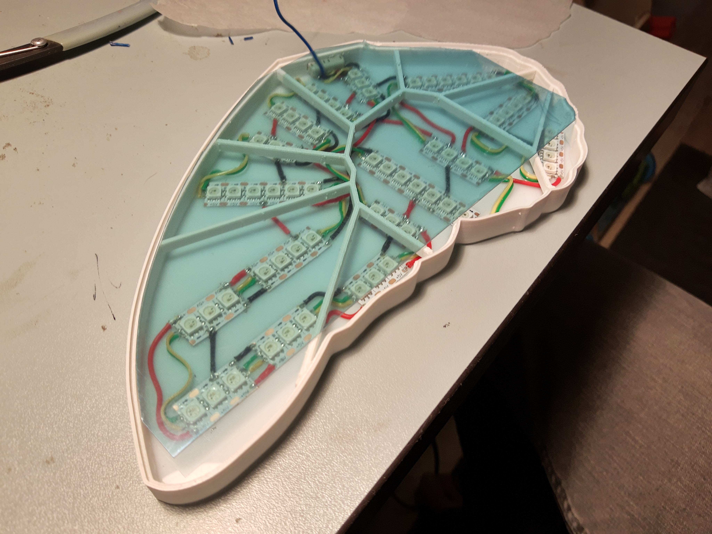

My first approach was to use  [conductive
paint](https://www.bareconductive.com/)  to paint the Voronoi pattern on top of
the front plexi. Idea was that loose end of the wire would be painted over and
held in place by the paint. That did not work because conductive paint does not
stick to plexi. I used paper tape to mask the lines and when I pulled the tape
off, conductive paint decided to stick with the tape rather than the panel.

Second approach, was to use silver adhesive, conductive tape to lay out Voronoi
pattern on top of the front cover. Touch sensor wire would be connected outside
of the panel, but simply one of the pattern's edges extended to inner side of
the front cover, where it was wrapped over the touch sensor wire.

This was a limited success (see video above); touch controls worked, but there
were constant problems with maintaining electrical connection between segments
in the pattern. Also, visual effect wasn't exactly what I hoped it would be.

So after some digging around the interwebs I found transparent,  [conductive
plastic
sheet](https://kamami.pl/en/conductive-materials/563060-conductive-pet-ito-with-dimensions-100mm-x-200mm.html).
It's easy to cut and provides additional diffusion of light. Once cut, can
simply be placed on top of the baking paper, err.. light diffuser. Stripped
fragment of the touch sensor wire should be placed on top of the conductive
layer (can be taped, but I didn't bother), and front cover placed directly on it
and glued to the walls.

And that's it, panel is now touch sensitive.

## Software

Software for the controller is built on top of the
[ESPHome](https://esphome.io/)  framework. Everything is captured in a short
YAML configuration file. Let's go over each section of the configuration.

### [Substitutions](https://esphome.io/guides/configuration-types.html?highlight=substitutions#substitutions)

```yaml
substitutions:
  name: "kids-room-bedlight"
  num_leds: '66'
  max_led_idx: '65'
  gamma_correct: '1.5' 
```

These definitions hold values which are use in several places throughout the
configuration. To make it easier to tweak those values, it's good to have them
defined in one place. Basic, run-of-the-mill constants for:

- *name*: name of the device which will be used as host name, as well as Home
  Assistant entity for the light. Here it's "Kid's room bed light" because
  that's where the panel will be placed
- *num_leds*: total number of LED diodes in the device
- *max\_led\_idx*: highest value for zero-based index of LED. Has to equal to
  *num_leds*  \- 1
- *gamma_correct*: gamma correction factor applied to lights

### ESPHome configuration

```yaml
esphome:
  name: ${name}
  project:
    name: "hexalight.lowpoly-butterfly"
    version: "1.0.0"

esp32:
  board: esp32dev
  framework:
    type: arduino

# Enable logging
logger: 
```

This section contains basic configuration of the  [ESPHome framework
itself](https://esphome.io/devices/esp32.html). See how previously defined
device name is used, using `${name}` syntax?

Project section allows for defining manufacturer (yeah, I know :D) and model
name, as well as version.

"esp32" defines values needed for [PlatformIO](https://platformio.org/)
framework on which ESPHome is built upon. Selects board type and low-level
firmware framework - operating system and set of libraries to use. In this case,
Arduino is used to fuel the code.

### API and interfaces

```yaml
# Enable Home Assistant API
api:

ota:
  password: !secret ota_password

wifi:
  ssid: !secret wifi_ssid
  password: !secret wifi_password

# Enable fallback hotspot (captive portal) in case wifi connection fails
ap:
  ssid: "Lowpoly-Butterfly"
  password: !secret ap_password

captive_portal:
```

This part enables ESPHome awesomeness:

- *api*: adds support for the  [Home Assistant](https://www.home-assistant.io/)
  interface, making the device magically appear in the home automation
- *ota*: enables Over-the-air firmware updates. Only first programming needs to
  be done using serial interface, any subsequent update will go through Wi-Fi
- *wifi*: turns on Wi-Fi stack, allowing the device to connect to network
  specified by  *ssid*  using provided  *password*
- *ap:* enables fallback hotspot, AKA captive portal. If connection to selected
  network fails, device will set up its own hotspot, using  *ssid*  and
  *password*  provided here
- *captive_portal*: (requires enabled access point); when Wi-Fi connection
  fails, device will display a web page to re-configure Wi-Fi
- *web_server*: (optional) when enabled, device will be accessible using web
  interface, allowing for remote control even without Home Assistant setup
- *esp32_improv*: (optional) when enabled, device will use ESPHome
  implementation of the  [Improv](https://www.improv-wifi.com/)  standard to
  provision ssid and password. So, no need to type them in configuration file.

Notice the "*!secret some_password*" syntax in all the places which require
providing a password. Using the "*!secret*" tag, ESPHome scripts refer to a
separate file - secrets.yaml - to look for the password. This way ESPHome config
files can be shared over the internat without exposing passwords to own Wi-Fi.
Of course that's assuming you don't file the secrets.yaml...

### Peripherals configuration

Now, configuration of ESP32's peripherals.

```yaml
switch:
- platform: restart
  name: "Restart Light" 
```

This part defines a virtual  [reset
button](https://esphome.io/components/switch/restart.html). Switch will be
visible as an entity in Home Assistant and web interface (if enabled).

- esp32\_touch: setup\_mode: false iir\_filter: 15ms low\_voltage\_reference:
  0.5V high\_voltage\_reference: 2.7V voltage\_attenuation: 1.5V
- '*esp32_touch*' enables code for  [touch sensor
  pads](https://docs.espressif.com/projects/esp-idf/en/latest/esp32/api-reference/peripherals/touch_pad.html)
  built into the ESP32 device. ESP32's touch pad peripheral continuously charges
  and discharges the touch pad (in this case - the conductive plastic sheet
  under front cover). Changes in the charge/discharge timings indicate change of
  capacity of the touch pad. And capacity of the touch pad changes when it is
  touched.
- *setup_mode*: when set to true, touch pad is in setup mode, in which results
  of the touch pad measurements are periodically printed out to the log. Useful
  when building the device, because it makes calibration of the touch pad super
  easy
- *iir_filter*: enables  [Infinite Impulse
  Response](https://en.wikipedia.org/wiki/Infinite_impulse_response)  filter to
  be applied to the touch pads. Can increase accuracy, and turned out to be
  helpful for making the touch panel work
- *low\_voltage\_reference*,  *high\_voltage\_reference*: reference values for
  voltage used by ESP32 touch pad subsystem to analyze the charge/discharge
  pattern. Used to tune the performance of touch panel
- *voltage_attenuation*: value of the voltage attenuation to use for the charge
  cycles. Based on my observations, increasing this value increases resolution
  of the touch pad, making it easier to determine a threshold for on/off values

### Lights

As probably expected, configurations related to LEDs themselves consumes most of
the configuration file. Let's go over it in steps.

```yaml
light:
  - platform: fastled_clockless
    gamma_correct: ${gamma_correct}
    restore_mode: ALWAYS_OFF
    rgb_order: GRB
    chipset: WS2813
    pin: GPIO22
    num_leds: ${num_leds}
    name: "Right Wing"
    id: right_wing
    internal: true

- platform: neopixelbus
  gamma_correct: ${gamma_correct}
  restore_mode: ALWAYS_OFF
  type: GRB
  variant: WS2813
  pin: GPIO23
  num_leds: ${num_leds}
  name: "Left Wing"
  id: left_wing
  internal: true 
```

First, we have to define low-level libraries to interact with LEDs. These map to
physical layout of the diodes. Note that two different libraries are used:
[FastLED Clockless](https://esphome.io/components/light/fastled.html)  and
[Neopixelbus](https://esphome.io/components/light/neopixelbus.html). These
libraries provide similar set of features to control addressable LEDs. Two
different are used because code wouldn't compile when the same library was used
for two separate sets of lights. Probably something related to use of global
variables, but I wasn't really inclined to debug this; perhaps another day. For
now, one library is used for left wing, the other for right wing.

Both libraries have a very similar set of configuration options:

- *platform*:  *fastled_clockless*  or  *nexopixelbus*  selects underlying
  library to use for the light entity
- *gamma_correct*: gamma correction factor to apply to this light
- *restore_mode*: defines how light should behave on power up. ALWAYS_OFF is a
  safe bet to make sure light won't randomly turn on when power comes back from
  outage or when the devices encounters a software bug and resets in the middle
  of the night
- *rgb_order*  or  *type*: defines order in which colors in LED are to be
  defined; if defined incorrectly, configuration will not match actual color
  channel, and setting values for red would change another color in the LED.
- *chipset*  or  *variant*: select model of the RGB LED diode used in the LED
  strip
- *pin*: pin in ESP32 module to which LED strip is connected
- *num_leds*: number of LEDs in connected to selected pin
- *name*: (optional) name for this light; typically, that's the name that would
  be displayed in Home Assistant
- *id*: unique identifier for the light used within the code
- *internal*: set to true means that this light will not be exposed externally,
  in Home Assistant or web interface

Logical definition uses  [ESPHome's light
partition](https://esphome.io/components/light/partition.html)  feature which
allows for merging several physical lights into single, controllable light
entity (it also allows for splitting a single physical light into several
logical ones).

Some options are common to all light entities (*name*,  *id*,  *restore_mode*,
...), so let's skip them here.

- *segments*: definition of segments used by this partition. Defines which
  physical lights and which LEDs in those lights should be used for the
  partition. Here, all diodes from both wings are selectd
- *id*: identifier of physical light
- *from*  and  *to*: range of LED  indices  to use for the segment
- *effects*: defines list of light effects (also known as scenes, animations,
  etc.) for the logical light entity
- *addressable_lambda*: uses  [*lambda
  expression*](https://en.cppreference.com/w/cpp/language/lambda)  for
  definition of an effect
- *name*: name of the effect
- *update_interval*: defines how often should the lambda expression be executed
- *lambda*: body of the lambda expression
- *addressable_rainbow*: creates effect of a floating rainbow by cycling through
  entire RGB space on each LED
- *addressable_twinkle*: randomly twinkles individual diodes, creating effect of
  blinking stars

Some effects are defined by raw C++ code. The "Reading Light" effect is simple.

```c
  it.all()= Color(255, 170, 160);
  return;
```

This sets all diodes to a specific color. I picked this color because it's easy
on the eyes, bit pinkish, and reduces strain when reading. "Voronoi" effect is
more complex. I wanted an effect which lights up each partition in the Voronoi
pattern individually, and smoothly transitions colors for each of the partition.
Also wanted to make sure that colors used will resemble an actual  [monarch
butterfly](https://www.google.com/search?client=opera&q=monarch+butterfly).
Lambda expression for this effect is evaluated every 1 ms.

```c++
  #define INT_TO_FIXED16(n) (n << 8)
  static const uint8_t nsegments = 18;
  static const uint8_t speed = 2;

  // Count of LEDs in each of the segments
  static const uint8_t segments[nsegments] = {6, 6, 5, 12, 2, 13, 3, 4, 5,\
                                              7, 6, 5, 12, 2, 13, 5, 4, 3};
  static uint16_t colors[nsegments];
  
  static const uint16_t min_hue = INT_TO_FIXED16(142);
  static const uint16_t hue_range = INT_TO_FIXED16(81);
  static const uint16_t max_hue = min_hue + hue_range;
```


Note how all the configuration constants/variables are defined as  *static*.
This keyword makes these variables persistent over subsequent evaluations.
Values set to those variables in one evaluation are kept for the next one.

```c++
  if (initial_run) {
    for (int i = 0; i < nsegments; i++) {
      // Initialize to a random color
      colors[i] = (uint16_t)(random_uint32() & 0x0000FFFF);
    }
  }
```

This code generates random target color for each partition (AKA segment) in the
Voronoi pattern.

```c++
  ESPHSVColor hsv(0, 240, 255);
  uint16_t start = 0;
  for (uint8_t i = 0; i < nsegments; i++) {
    uint16_t end = start + segments[i] + 1;
    colors[i] = (colors[i] + speed) % 0xFFFF;
    hsv.hue = (colors[i] >> 8) & 0xFF;
    it.range(start, end) = hsv.to_rgb();
    start = end;
  }
  return;
```

And finally, loop that makes gradual color transition for each partition.

### Touch controls

Touch pad controls use  [binary sensor implementation in
ESPHome](https://esphome.io/components/binary_sensor/esp32_touch.html).

```yaml
  binary_sensor:
  - platform: esp32_touch
    name: "On/Off"
    pin: GPIO32
    threshold: 1150
    filters:
      - delayed_on_off: 50ms
    on_click:
      - min_length: 800ms
        max_length: 5000ms
        then:
          - light.turn_off: lowpoly
      - min_length: 50ms
        max_length: 700ms
        then:
          lambda: |-
             ... 
```

- *platform*: defines which physical peripheral should be used for the sensor;
  here it's '*esp32_touch*'
- *name*: name of the switch which will be used in Home Assistant/web interface
- *pin*: physical GPIO which is used by the sensor. This corresponds to GPIO to
  which the touch sensor wire is connected
- *threshold*: ESP32 touch pad peripheral returns integer values; the lower the
  value, the higher probability that touch pad was touched. Binary sensor will
  change the state to 'On' when readings from the touch pad drop below the
  *threshold*  defined here
- *filters*: defines filters to use for raw values incoming from the hardware
- *delayed\_on\_off*: creates a slight delay between publishing any state change
  ('Off' to 'On' or  *vice versa*). Useful for filtering noise in readings from
  the touch pad
- *on_click*: defines behavior of the touch pad when touched
- *min_length*  and  *max_length*: specify duration of time touch pad needs to
  be activated before taking an action
- *then*: defines action to be taken

Code here implements two modes of operation:

- when "On/Off" panel (left wing) is touched for anywhere between 800 and 5000
  ms, light is turned off by invoking action: `light.turn_off: lowpoly`
- when "On/Off" panel is touched for a shorter time (50 - 700 ms), action
  defined by lambda is taken

```c++
  static const int levels = 5;
  static const float brightness_levels[levels] = {0.0, 0.15, 0.45, 0.8, 1.0};
  
  static int current_level = 0;
  
  current_level = (current_level + 1) % (levels);
  
  auto effects = id(lowpoly).get_effects();
  std::string effect_name = id(lowpoly).get_effect_name();
  if (effect_name == "None") {
  	effect_name = effects.front()->get_name();
  }
  
  if (current_level > 0) {
      auto call = id(lowpoly).turn_on();
      float brightness = brightness_levels[current_level];
      call.set_brightness(brightness);
      call.set_effect(effect_name);
      call.perform();
  }
  else {
   	auto call = id(lowpoly).turn_off();
   	call.perform();
  }
  return; 
```

This action makes the light cycle through specific brightness levels, while
maintaining activated effect. Each touch will make the light go to 15%, 45%,
80%, 100%, and 0% (lights off) of the brightness. For the right wing,
configuration is similar:

```yaml
  - platform: esp32_touch
   name: "Toggle Effect"
   pin: GPIO33
   threshold: 1050
   filters:
    - delayed_on_off: 100ms
   on_click:
    - min_length: 800ms
      max_length: 5000ms
      then:
        - light.turn_off: lowpoly
    - min_length: 50ms
      max_length: 700ms
      then:
        lambda: |-
          ... 
```

Long touch will turn the light off, short will activate a lambda which cycles
through defined light effects:

```c++
  auto call = id(lowpoly).turn_on();
  auto effects = id(lowpoly).get_effects();
  std::string name = id(lowpoly).get_effect_name();
  uint8_t i = 0;
  if (name != "None") {
  	// There's an effect in progress, move to the next one
  	for (auto e : effects) {
  		++i %= effects.size();
  		if (e->get_name() == name) {
  			break;
  		}
  	}
  }
  call.set_effect(effects[i]->get_name());
  call.perform();
  return; 
  - 10)
```

And that's it! Compile and upload using ESPHome, and the butterfly light panel
should light up.

## Final Thoughts

There are definitely some improvements to be had with this design:

- overhaul the power delivery part of the controller
- see if placing the LEDs vertically along the edges of Voronoi pattern would
  improve light diffusion effect
- make the touch panels more robust

Still, I'm super happy with the result. Maybe next version of the panels will
see those improvements. I still have a slanted wall with no reading light in my
own bedroom...
